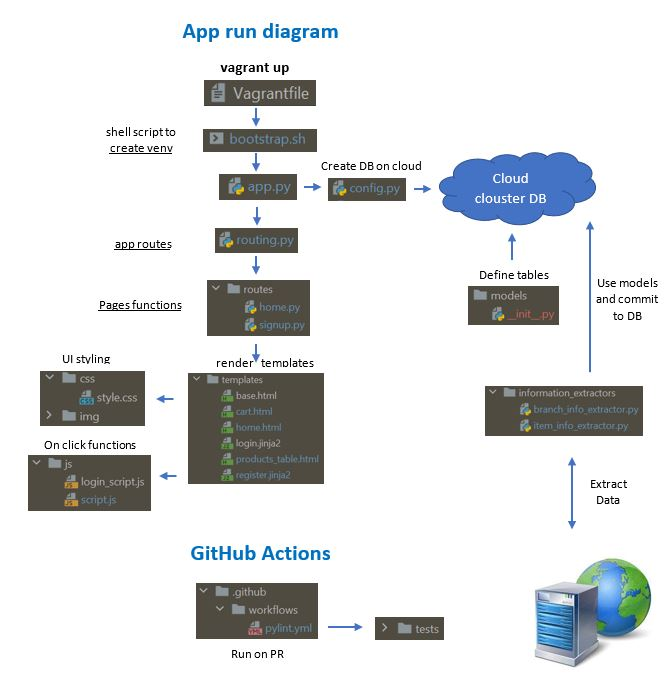

# Project Architecture
  In this document we will describe how the project is built, which technologies we used to built it and how they interact.
  - [Flow & Structure](#Flow-&-Structure)
  - [App run diagram](#App-run-diagram)

## Flow & Structure

 _**Vagrant file-**_ 
 Defines the VM the app runs on. Works on ubuntu/bionic64 OS, triggers bootstrap.sh file.

 _**bootstrap.sh-**_ 
 Updates the OS (if update exists), defines the app environment & installs dependencies. Then runs app.py on localhost:5000

 _**app.py-**_  
Configures the app variables, configures the connection to the DB (based on config.py), runs all app routes (from routing.py) and defines a dictionary that will be used in the extractors scripts

## superx folder

 _**information extractors-**_ 
 Two scripts which run on the relevant urls and extract data published by different food chains. branch_extractor gets the data of the different food branches, and item_extractor gets the products and their prices. The data is stored in the DB configured in app.py

 _**models-**_ 
Contain _ init _.py, a file which determines the different tables columns defined in the DB. 
  Post & Get methods to the DB requires importing models folders

 _**routes-**_ 
 home.py & signup.py, define the app's functionality from user sign in to searching and comparing products. 
 - Rendering html files from templates dir.
 - Based on script.js & login_script.js from static/js

 _**static-**_ 
 Images, CSS styling & JS scripts of the website

 _**templates-**_ 
 Html & jinja2 files of the app's different pages

 _**tests-**_ 
 Tests to the different functionality of the system.   To run the tests- 
1. Activate the VM
2. Activate superx venv
3. Go to /vagrant/superx folder (not listed with dir command)
4. Run "python -m pytest"

## CI- .github/workflows
 _**Pylint.yml-**_ 
 CI for running all relevant tests whenever a PR is made

### More files
 _**README.md-**_  description of the project's purpose, how it works and main contributors

 _**DB Design.jpg-**_  the data structure of the project including relationships between tables

 _**Contributing.md-**_ contribution guidelines to the project 

 _**.vagrant folder-**_  all relevant data to the VM

 _**.gitignore-**_  irrelevant files (github will ignore  them)

# App run diagram

