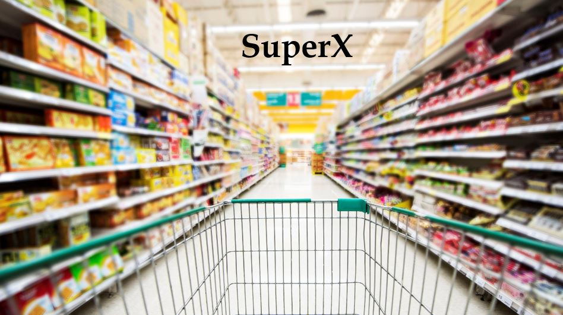

## **Main Goal** 
**Comparing prices between supermarkets by using accessible data- to save money**
- To activate and use the app- please follow the instructions in [User's_Guide file](User's_Guide.md)

## Project Architecture
The project runs on Vagrant VM & uses flask as a web framework.
To create the project's envrionment- bootstrap.sh file is triggered when the app starts running.

### **Frontend** 
Client UI to choose the products to compare and the city where the client lives.  
<u>Languages</u>- HTML, CSS, JS

### **Backend**
Information extractor scripts that web scrape supermarket urls, extract the relevant information and places it into the db. 
<u>Language</u>- Python

### **Database** 
MySQL relational database, stored in the cloud. 
<u>ORM</u>- SQLAlchemy

- For better understanding of the code structure & different files please visit [Architecture guide](Project_Architecture.md)

### Contribute :tada:
- At this point we compare between 3 major supermarkets - Mega, Shufersal & Victory
- To help us compare between more products and more supermarkets- please read [CONTRIBUTING file](CONTRIBUTING.md)

## Team
- Oded Hellman
- Yoav Ben Hur  
- Aryeh Klein
- Shai Brown

